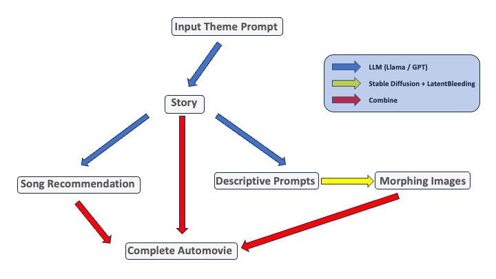

# AutoMovie – Fully AI Generated Movies

AutoMovie is an artistic project that automatically generates cinematic clips from a simple input theme. It leverages LLMs, as well as generative image and audio models in order to create a storyboard, matching images and transitions between the frames in a fully automated fashion. 



## Quickstart

```bash
python morph.py  # Interactive movie mode
python morph.py --preset zengarden  # Background visual mode with the "zengarden" preset
   ```
## Video Examples

### Short Horror Movie
Check out this short horror movie clip:

https://github.com/c-ali/automovie/blob/main/media/horror.mp4

### Beautiful Visual (No Subtitles)
The theme is spirals in nature:

https://github.com/c-ali/automovie/blob/main/media/spiral_short.mp4

## Overview

AutoMovie automates the creative process of generating a movie by:
- Generating a story based on an input theme
- Creating matching keyframes
- Generating subtitles to concisely tell the story matching the keyframes
- Smoothly interpolating the keyframes to create transitions
- Integrating a fitting musical score
- Assembling all components into a seamless video clip of the desired length

This project provides a platform for creative exploration with AI-driven content generation.

## Features

- Subtitles can be disabled in order to create "ambient visuals"
- Videos are created in high quality 1080p resolution using the Stable Diffusion XL model
- Possibility to upscale to 4k resolution using an AI upscaler
- Hyperparameters for transitions can be adjusted for either more realistic transition images or smoother transitions
- SD Turbo support for almost real-time video generation
- User can chose between local models and API for LLMs
- Multiple presets for fast generation (i.e. short movie, music festival visuals etc.)
- Watermarking the final video is supported

### Text Generation

A story is created from the input theme using either a local Llama model or the ChatGPT API. The base storyboard is then further refined to short subtitles which are later overlayed to the generated images.

### Image Generation

The LLM model above is also used to generate the promts which are then fed to the diffusion model based on [Stable Diffusion](https://stability.ai/stable-image). Keyframes are then interpolated using [Latent Bleeding](https://github.com/lunarring/latentblending) in order to obtain smooth transitions.

### Music Generation

The user can either chose to automatically grab a matching song from youtube as background music (chosen by the LLM) or use audio AI models to generate a new song using Meta's [MusicGen](https://huggingface.co/spaces/facebook/MusicGen).

### Video Assembly

The final stage combines the generated text as subtitles, images, and audio to the final movie using [FFmpeg](https://github.com/kkroening/ffmpeg-python).

## Installation

### Prerequisites

- **Python 3.8+** – Ensure you have a compatible version of Python installed.
- **FFmpeg** – Required for video processing and assembly.
- Additional Python libraries listed in the `requirements.txt` file.

### Steps

1. **Clone the Repository:**
   ```bash
   git clone https://github.com/yourusername/automovie.git
   cd automovie
   ```
2. Install dependencies
   ```bash
   pip install -r dependencies.txt
   
3. Launch script
    ```bash
      python morph.py     # Launch script 
      python morph.py -h  # For help with arguments
      python morph.py -t 5 -p 10  # Short movie with 10 prompts/keyframes and 5 second transitions
   ```
### Presets
Can be found and expanded in the "presets.py" file.


### License

This project is licensed under the MIT License. See the LICENSE file for more details.

